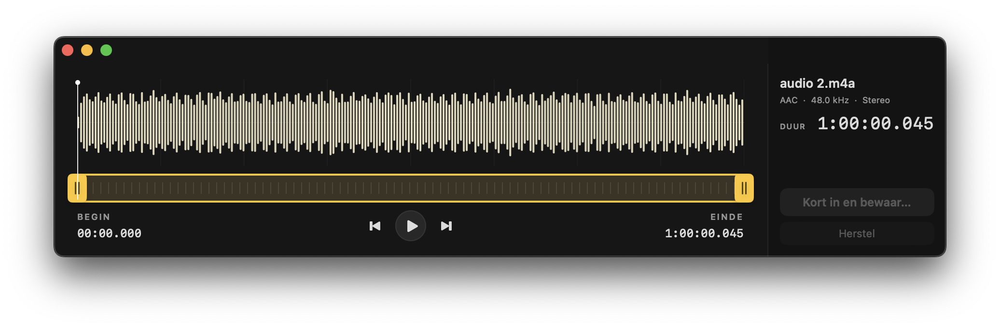
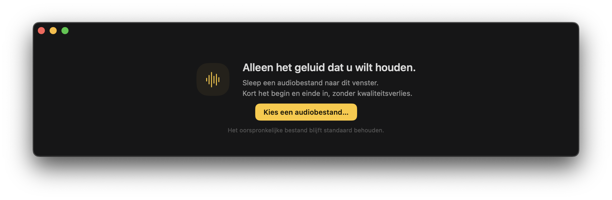
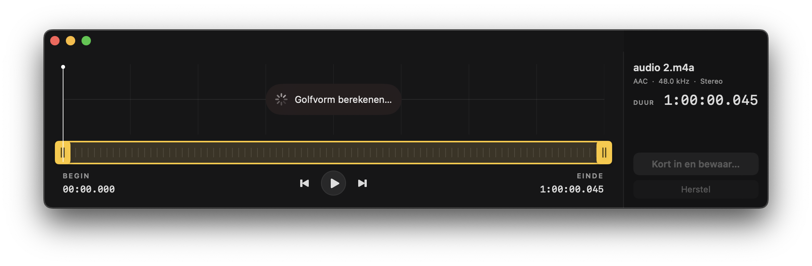
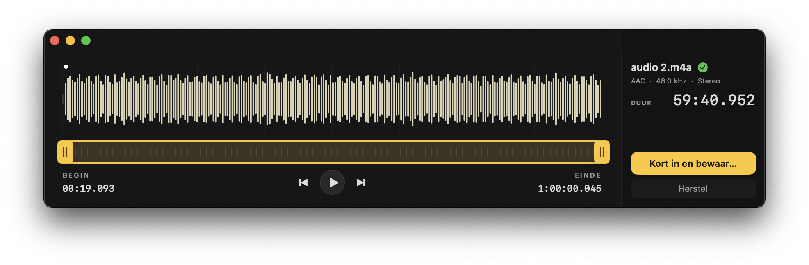
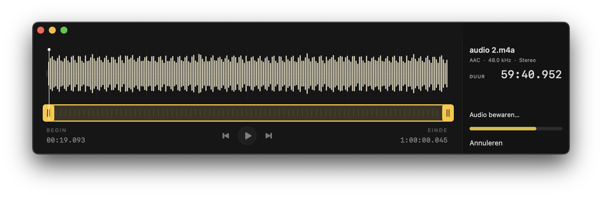

# Trimmer

A small native macOS app for trimming the beginning and end of audio files **without re-encoding**.

<p>
  
  
  <a href="LICENSE"></a>
  
</p>



> **Work in progress.** The core editing flow works with an existing FFmpeg installation, but Trimmer is still under development. The built-in Homebrew/FFmpeg installation flow is implemented but has not yet been validated. The interface is currently in Dutch.

## What it does

Open an audio file, listen, find your cut points and save the part you want to keep. Trimmer focuses on this one task, in a compact window inspired by QuickTime’s trim controls.

- A waveform calculated from the actual audio, with playback and scrubbing.
- Two trim handles for adjusting the start and end. No timeline editing or effects.
- Magnetic alignment to the playhead, snapping to the nearest valid audio packet boundary.
- Export using FFmpeg stream copy, preserving the audio codec, sample rate and channels.
- A new filename by default: `recording.m4a` becomes `recording-trimmed.m4a`.
- A standard macOS save dialog for choosing a name, location or deliberate replacement of an existing file.

Audio processing happens locally. FFmpeg is an external dependency, not bundled with the app.

## Build and run

You need macOS 13 or later, Xcode 15 / Swift 5.9 or later, and working `ffmpeg` and `ffprobe` executables. For this early version, use an existing FFmpeg installation; validating the in-app installer is planned for later.

If Homebrew is already installed, FFmpeg can be installed with:

```sh
brew install ffmpeg
```

Then build the app:

```sh
git clone https://github.com/florisvandesande/Trimmer.git
cd Trimmer
bash scripts/build-app.sh
open dist/Trimmer.app
```

The build script creates a release app for the architecture of your Mac, adds the app icon and signs it locally. You can move `dist/Trimmer.app` to Applications. This is an ad-hoc signed local build, not a Developer ID-signed or notarized release.

You can also open `Package.swift` in Xcode. There are no third-party Swift package dependencies.

## Using Trimmer

1. Choose a file from the welcome screen or File menu, or drag it into the window.
2. Play the audio and click or drag in the waveform to find a cut position.
3. Drag the yellow handles to select the part to keep.
4. Choose **Kort in en bewaar…** (“Trim and save…”).

After you have played or sought through the audio, moving a trim handle leaves the playhead in place. Within six screen points, the handle snaps to the nearest valid cut point at the playhead. Move away to release it. If the playhead has not been used, or you seek back to zero, it follows the trim handle instead.

Playback stops at the end of the selection. The button to the left of Play returns to the selection’s start; the button to the right previews its last three seconds. **Herstel** resets the selection.

| Shortcut | Action |
| --- | --- |
| `Space` | Play or pause |
| `←` / `→` | Seek backward / forward by one second |
| `⌘ O` | Open audio |
| `⌘ S` | Trim and save |
| `⌘ 0` | Reset the selection |

Saving keeps the original file by default. Export is written to a temporary file beside the destination and checked before being moved into place. An existing destination is replaced only after a successful export and confirmation in the save dialog.

## Screenshots

The screenshots show the current Dutch interface.

<details>
<summary>Welcome, waveform loading, completed trim and export progress</summary>

### Open an audio file



### Calculate the waveform



### Save a selection



### Follow export progress



</details>

## Formats and cut precision

Integration tests cover MP3, AAC in M4A, WAV, AIFF, FLAC and Opus. Other audio formats may work if FFmpeg can write their container without conversion. Video and files with multiple audio tracks are outside the current scope. Embedded cover artwork is supported.

**No re-encoding does not mean sample-accurate cutting.** Compressed audio is cut at packet boundaries. Decoder delay and dependencies between packets can cause a small difference at the edges compared with the preview. Trimmer does not add fades, normalize volume or apply audio filters.

General metadata and cover artwork are copied. Chapters are removed because their timestamps describe the original recording. Native FLAC needs a header repair after stream copy to report the new duration correctly; the compressed audio subframes remain unchanged.

See [technical notes](docs/technical-notes.md) for playback, waveform generation, FLAC handling and dependency installation details.

## Development

Run the tests with the existing FFmpeg installation:

```sh
swift test
```

Tests cover copied packet payloads or decoded samples, output duration and audio properties, artwork and metadata, safe saving, cancellation and trim/playhead interaction. Audio integration tests are skipped if FFmpeg is unavailable.

Bug reports and focused pull requests are welcome. See [CONTRIBUTING.md](CONTRIBUTING.md) for setup, useful bug report details and the project’s scope.

### Next steps

- Validate first-run Homebrew and FFmpeg installation on clean Macs.
- Broaden testing across macOS versions, hardware and audio files.
- Add English interface localization.
- Prepare signed and notarized releases.

## License

Trimmer is available under the [MIT License](LICENSE). FFmpeg and Homebrew are separate projects distributed under their own licenses.
